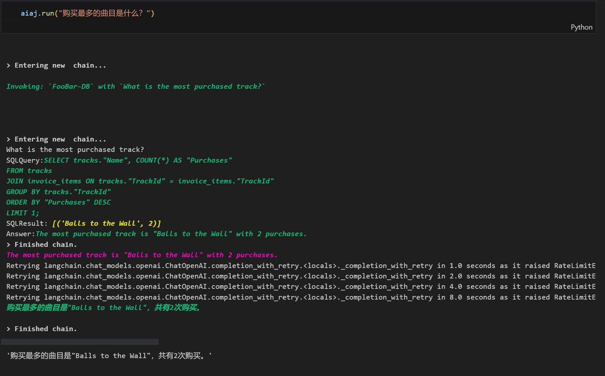

# Function_Calling

函数调用 | 网页搜索 | 知识库搜索

WeChat 小程序：AI 爱家

# 目录

- [函数调用功能实现](#函数调用功能实现)
  - [简单用例](#简单用例)
  - [一般步骤](#一般步骤)
  - [具体步骤](#具体步骤)
- [LangChain 对 Function calling 的支持](#LangChain-对-Function-calling-的支持)
- [网页搜索和数据库搜索](#网页搜索和数据库搜索)
- [参考文献](#参考文献)


## 函数调用功能实现

Function calling 可使我们能够利用模型的 NLU(Natural Language Understanding) 能力，有效地将人类语言转化为结构化数据或我们代码中的具体函数调用。这种能力在 AI 爱家小程序的各种场景中都很有用，从创建可以与其他 API 互动的聊天机器人，到文本后处理任务和从自然语言输入中提取结构化信息，都可以有效的提高回复质量

### 简单用例

`code/demo1.ipynb`文件展示了一个简单用例

- 首先定义了三个函数`get_apple_yield`, `get_current_data`, `get_history_date
- 设置函数的各项参数: `name, description, parameters, required`
- function 模块中一次可以定义多个函数，但是`gpt-3.5-turbo-16k-0613`会自主决定调用哪一个函数或者不调用函数使用模型能力回答，比如下面给出的返回函数为`get_current_time`
```
 "message": {
        "content": null,
        "function_call": {
          "arguments": "{\n\"time\": \"now\"\n}",
          "name": "get_current_time"
        }
```

### 一般步骤

`code/demo2.ipynb`文件展示了 Function calling 的一般步骤

- 使用预定义好的函数和用户输入来调用模型
- 使用 LLM 回答来调用 API
- 将 API 的 response 返回 LLM 并生成总结

其中的 OpenAI 部分具体的参数设置规则为
- Name 这是函数的标识符或名称。
- Description：这是对函数功能的简洁说明。模型将依赖此描述来确定何时应调用此函数。
- Parameters：参数对象包含函数需要的所有输入字段。这些输入可能的类型包括：字符串（String）、数字（Number）、布尔值（Boolean）、对象（Object）、空值（Null）等等。
- Required：在进行查询时必须提供的参数。未在此列表中的参数视为可选项。

### 具体步骤

而后调用函数的具体步骤为
- 设置`user_query`为用户提出的问题
- function_call="auto" 即让模型自主选择是否使用 function calling 功能
- 以询问成都天气为例，获得大模型的回答是
```
{
  "content": null,
  "function_call": {
    "arguments": "{\n  \"location\": \"Chengdu, Sichuan\",\n  \"unit\": \"celsius\"\n}",
    "name": "get_current_weather"
  },
  "role": "assistant"
}
```
- 将此回答传入获得当前天气的函数或 API 后，获得如下json格式回答
```
'{"location": "Chengdu, Sichuan", "temperature": "25", "unit": "celsius", "forecast": ["sunny", "windy", "cloudy", "rainy", "snowy", "stormy", "foggy", "hail", "sleet"]}'
```
- 将json格式回答再度传递给模型以获得自然语言的回答
```
The current weather in Chengdu is 25°C and it is sunny.
```

## LangChain 对 Function calling 的支持

[2023.6.14] LangChain 更新对 Function Calling 的支持，使用版本`langchain==0.0.199`

如 `code/demo2.ipynb` 中的财务预测用例所示：

```
llm = ChatOpenAI(model="gpt-3.5-turbo-16k-0613", openai_api_key="YOUROPENAIKEY")
tools = [MoveFileTool()]
functions = [format_tool_to_openai_function(t) for t in tools]
```
结论是对于多次提问，LLM在前几次使用了函数调用功能后，意识到自己已经将人数，年份和总量计算清楚后，就不再使用function calling功能（kwargs参数返回空值），而是直接通过LLM返回了一个response。这是因为LLM认为这个response是一个更好的回答，而不是使用function calling功能。所以，LLM在选择是否使用function calling功能时，是有自己的判断标准的，而不是我们自己的判断标准。

## 网页搜索和数据库搜索

[2023.6.15] LangChain 再度更新 Function Calling 支持，使用版本`langchain==0.0.200`

`code/demo3.ipynb`中展示了LangChain结合OpenAI函数能力的例子，提前准备好了一些音乐商店资料，存储在数据库文件`data/chinook.db`

此示例创建了一个名为aiaj(AI爱家)的代理，它可以根据用户的输入调用不同的工具，并生成答案。其中定义了三个functions,分别是
- Search: 使用SerpAPIWrapper的run方法，用于根据特定查询执行网络搜索
- Calculator: 使用LLMMathChain的run方法，可以执行简单的数学计算，不包括计算微积分和解一元二次方程
- FooBar-DB: 使用SQLDatabaseChain的run方法，可以从SQL数据库中获取信息（需要提前获得 Serp 数据库 API，并准备好数据库文件）

<details>
 <summary>Agent defination</summary>
```
llm = ChatOpenAI(temperature=0, model="gpt-3.5-turbo-16k-0613",openai_api_key="YOUROPENAIKEY")
search = SerpAPIWrapper(serpapi_api_key='YOURSERPAPIKEY')

llm_math_chain = LLMMathChain.from_llm(llm=llm, verbose=True)
db = SQLDatabase.from_uri("sqlite:///D:\\mydocument\\juxue\\OpenAI_use\\chinook.db")
db_chain = SQLDatabaseChain.from_llm(llm, db, verbose=True)

tools = [
    Tool(
        name = "Search",
        func=search.run,
        description="useful for when you need to answer questions about current events. You should ask targeted questions"
    ),
    Tool(
        name="Calculator",
        func=llm_math_chain.run,
        description="useful for when you need to answer questions about math"
    ),
    Tool(
        name="FooBar-DB",
        func=db_chain.run,
        description="useful for when you need to answer questions about FooBar. Input should be in the form of a question containing full context"
    )
]
aiaj = initialize_agent(tools, llm, agent=AgentType.OPENAI_FUNCTIONS, verbose=True)
```
</details>

使用这些工具和 OpenAI 模型初始化了一个名为 aiaj 的代理。当 aiaj.run 被调用时，它会根据用户输入的内容，调用适当的工具使用网络搜索，计算器或是 FooBar database，或者不调用任何函数生成回复。

<details>
 <summary>1. Search网络搜索</summary>
 
 搜索引擎选择 `pip install google-search-results`
 
 询问天气
 
 
 询问周杰伦
 
 
 询问武汉空轨
 
 
 询问电影上映
 
 </details>

<details>
 <summary>2. Calculator计算器</summary>
 询问数量计算
 
 
 </details>
 
 <details>
 <summary>3. FooBar数据库搜索</summary>
 
 询问数据库中最多作品的艺术家
 
 
 询问数据库中购买最多的作品
 
 </details>
 
 <details>
 <summary>4. 不调用函数</summary>
 
 询问亲密关系种类
 
 
 询问心理学家和精神病学家区别
 
 </details>

## 参考文献

1. [Function calling and other API updates](https://openai.com/blog/function-calling-and-other-api-updates)
2. [OpenAI function calling documentation](https://platform.openai.com/docs/guides/gpt/function-calling)
3. [Function Calling via ChatGPT API - First Look With LangChain](https://www.youtube.com/watch?v=0-zlUy7VUjg&t=2s)
4. [LangChain official Twitter Media](https:twitter.com/LangChainAI/media) 


